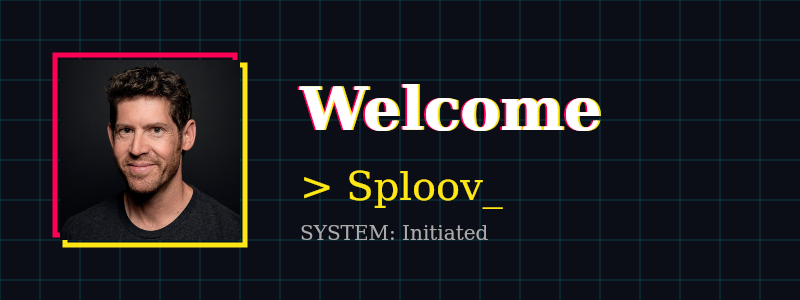
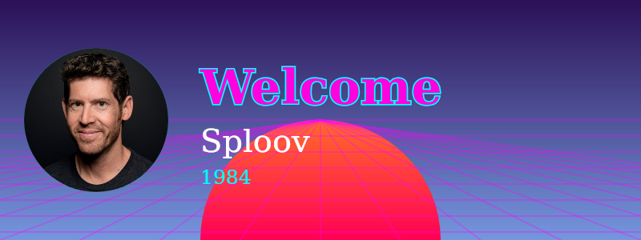

<div align="center">

# 🃏 Welcomize

**Create stunning, customizable welcome images for your Discord communities in milliseconds.**

[](https://www.npmjs.com/package/welcomize)
[](https://www.npmjs.com/package/welcomize)
[](https://github.com/sploov/welcomize/blob/main/LICENSE)
[](https://github.com/prettier/prettier)

<br />


<br />

[**Installation**](#-installation) •
[**Quick Start**](#-quick-start) •
[**Themes**](#-themes) •
[**API Reference**](#-api-reference) •
[**Contributing**](#-contributing)

</div>

---

## ✨ Features

- **🚀 High Performance:** Powered by `@napi-rs/canvas` for blazing fast image generation.
- **🎨 Pre-built Themes:** Comes with **8** themes including `Cyberpunk`, `Nature`, `Gaming`, and more.
- **🛠 Fully Customizable:** Control colors, fonts, backgrounds, and layouts.
- **📘 TypeScript:** Written in TypeScript with full type definitions included.
- **📦 Lightweight:** Zero heavy dependencies (uses pre-compiled binaries).

---

## 📦 Installation

Install `welcomize` using your favorite package manager:

```bash
# npm
npm install welcomize

# yarn
yarn add welcomize

# pnpm
pnpm add welcomize
```

---

## 🚀 Quick Start

Generate your first welcome card in just a few lines of code.

```typescript
import { Welcomize } from 'welcomize';
import { AttachmentBuilder } from 'discord.js';

// 1. Create the card
const card = new Welcomize({
    username: 'SploovDev',
    avatarUrl: 'https://github.com/sploov.png',
    theme: 'modern',
    title: 'Welcome!',
    subtitle: 'To the Sploov Community',
    borderColor: '#5865F2'
});

// 2. Render to buffer
const buffer = await card.render();

// 3. Send to Discord
const attachment = new AttachmentBuilder(buffer, { name: 'welcome.png' });
channel.send({ files: [attachment] });
```

---

## 🎨 Themes

Welcomize comes with **8 beautiful built-in themes**.

### 🔹 Modern
A sleek, gradient-based design with a glowing avatar.


### 🔹 Cyberpunk
Neon lights, glitches, and a dark futuristic aesthetic.


### 🔹 Nature
Calm greens, organic shapes, and a peaceful vibe.


### 🔹 Gaming
High contrast, angular shapes, and a competitive feel.


### 🔹 Retro
Synthwave aesthetics with suns, grids, and gradients.


### 🔹 Bubble
Soft pastel colors and rounded shapes for a friendly welcome.


### 🔹 Clean
Minimalist, bright, and professional.


### 🔹 Classic
The timeless solid-color Discord style.


---

## ⚙️ API Reference

### `WelcomizeOptions`

| Option | Type | Default | Description |
| :--- | :--- | :--- | :--- |
| `username` | `string` | **Required** | The username to display. |
| `avatarUrl` | `string` | **Required** | The user's avatar URL (png/jpg). |
| `theme` | `Theme` | `'classic'` | `'classic'`, `'modern'`, `'clean'`, `'cyberpunk'`, `'nature'`, `'gaming'`, `'retro'`, `'bubble'`. |
| `title` | `string` | `'Welcome'` | Main heading text. |
| `subtitle` | `string` | `'To the server!'` | Subtitle/message text. |
| `backgroundColor` | `string` | *Theme Default* | Hex color background. |
| `textColor` | `string` | `'#FFFFFF'` | Hex color for text. |
| `borderColor` | `string` | *Theme Default* | Accent/Border color. |
| `fontPath` | `string` | `undefined` | Local file path to a custom font (e.g., `./fonts/Roboto.ttf`). |
| `backgroundImageUrl` | `string` | `undefined` | URL or path to a custom background image (overrides color/gradient). |

---

## 🤝 Contributing

We love contributions! Please read our [Contributing Guide](CONTRIBUTING.md) to get started.

1. Fork the repo.
2. Create your feature branch.
3. Commit your changes.
4. Push to the branch.
5. Open a Pull Request.

---

<div align="center">

Made with ❤️ by the **Sploov** Team

[GitHub](https://github.com/sploov) • [Issues](https://github.com/sploov/welcomize/issues)

</div>
